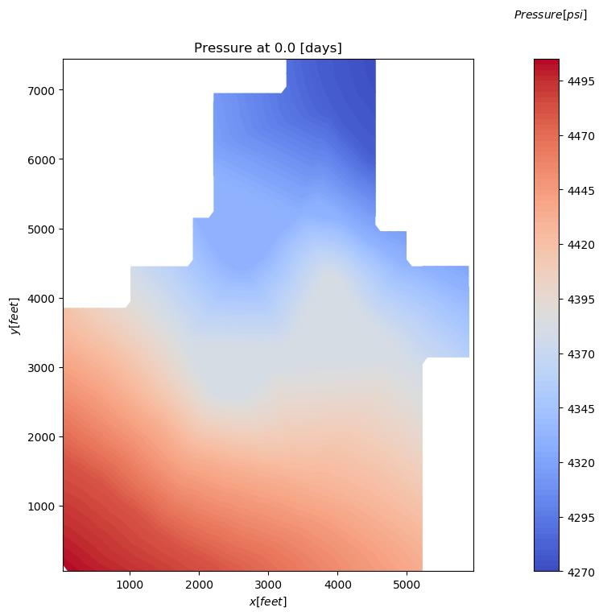
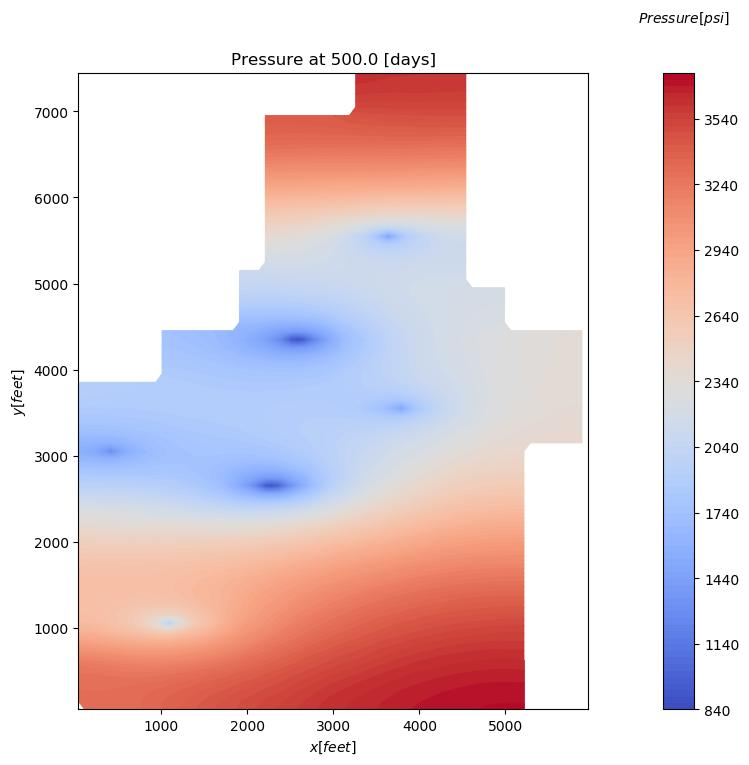
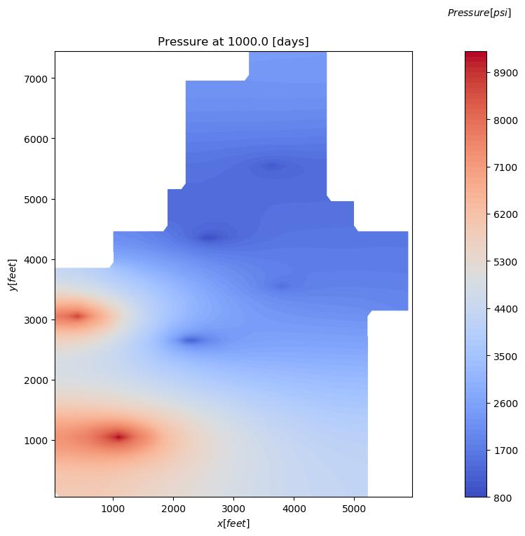

# One/Two-dimensional Reservoir Simulator
## Authors
- Mohammad Afzal Shadab (mashadab@utexas.edu)

## Affiliation
Oden Institute for Computational Engineering and Sciences / Jackson School of Geosciences / University of Texas Institute for Geophysics
The University of Texas at Austin

## 2-line Summary
This repository has 1D/2D single-/two-phase reservoir simulator that considers constant bottom hole pressure and constant rate vertical and horizontal wells, gravity, and heterogeneity. The Python code is validated with a commercial simulator, Computed Modeling Group Ltd. (https://www.cmgl.ca/).

## Citation
Shadab, M.A., 2022. Two-dimensional reservoir simulator, Zenodo DOI: 10.5281/zenodo.6581752.

## Second Project: Simulation of Nechelik reservoir

  
  
  

Figure : Pressure contour plots correspond to the simulation of the Nechelik reservoir (80 X 75 cells) with 6 wells (2 horizontal, 4 vertical) for 1000 days with a time step of 0.1 days. After 500 days, water is being injected into two wells on the bottom left for secondary recovery.

### Dependences

The codes requires the following packages to function:
- [Python](https://www.python.org/) version 3.5+
- [Numpy](http://www.numpy.org/) >= 1.16
- [scipy](https://www.scipy.org/) >=1.5
- [matplotlib](https://matplotlib.org/) >=3.3.4

### Quick Usage
After cloning the repository and installing the required libraries, run the python files given in the separate folders. Codes can be run either directly or on an IDE such as Anaconda Spyder. 

## Acknowledgement
I would like to acknowledge Professor Matthew Balhoff for teaching the course on Numerical Simulations of Resevoirs in 2020. His book has most of the theory circumscribing these codes which can be found here: https://utexas.instructure.com/files/50230455/download?download_frd=1
